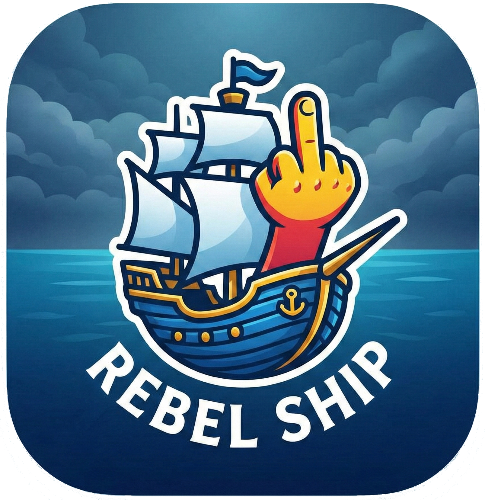
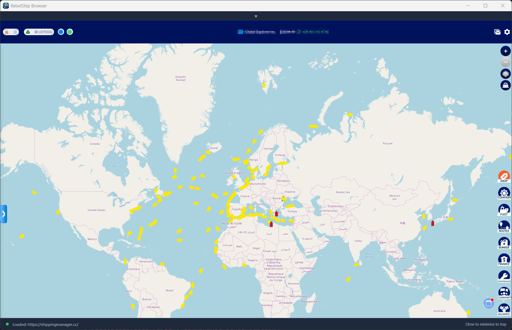

# 🏴‍☠️ The RebelShip Browser 🏴‍☠️

**Avast, ye scurvy dogs!** This tiny tool be a treasure gifted to all me hearties and Steam-sailors of the game **Shippingmanager.cc**. It lets ye play the Steam version in a browser without that cursed **T-Stroke bug** (blimey!). Now ye can finally christen yer ships proper-like or parley with other captains in the chat without yer quill breakin' or the ink runnin' dry!

### 💎 The Booty (Features)

* **Two Login Methods:** Choose between Steam Login (automatic) or Browser Login (manual) - whatever suits yer sailing style!
* **System Tray (The Crow's Nest):** Keeps a weather eye open in the background. Minimizes to the tray so it don't clutter yer deck.
* **Quick Access:** Double-tap the icon to bring her about and restore the window in a flash.
* **Re-Login:** If the seas get rough, switch accounts or grab a fresh key. Easy peasy.
* **Premium Map Themes:** All premium map styles unlocked - Dark, Light, Street, Satellite, City, and Sky. No doubloons required!
* **Tanker Operations:** Build tankers even without the achievement. Note: Ye can only BUILD tankers at the shipyard, not BUY them from the market!
* **Metropolis Routes:** Access metropolis port routes without purchase. Chart yer course to the biggest harbors!
* **Auto-Updates:** The app checks for updates on startup and lets ye update with a single click!
* **Script Manager:** Manage userscripts to enhance yer gameplay. Enable/disable bundled scripts or create yer own!

### 📜 Bundled Userscripts

The browser comes with these ready-to-use scripts (disabled by default - enable in Script Manager):

| Script | Description |
|--------|-------------|
| **Auto Depart** | Automatically departs vessels when they arrive at port |
| **Bunker Price Display** | Shows fuel and CO2 prices directly in the UI |
| **Buy VIP Vessel** | Enables purchasing VIP vessels from the market |
| **Depart All Loop** | Repeatedly clicks "Depart All" until all vessels have departed |
| **Export Messages** | Export all messenger conversations as CSV or JSON |
| **Export Vessels CSV** | Export your fleet data to CSV format |
| **Forecast Calendar** | Shows cargo demand forecasts in a calendar view |
| **Map Unlock** | Unlocks all premium map themes (Dark, Light, Satellite, etc.) |
| **Reputation Display** | Shows your company reputation next to the company name |
| **Save Vessel History** | Tracks and saves vessel purchase/sale history |
| **Vessel Shopping Cart** | Add vessels to a cart and bulk purchase them |

**Custom Scripts:** Create your own scripts in the Script Manager - they're stored separately from bundled scripts!

### 📜 The Ship's Articles (Requirements)

* A sturdy hull running **Windows 10/11**.
* The right rigging: **.NET 8.0 Runtime** (we packed it in the crate for ye).
* **For Steam Login:** Steam must be docked (installed) and ye must have sailed **shippingmanager.cc** at least once.
* **For Browser Login:** Just yer credentials - no Steam required!

### Dowload

Download last version: [here](https://github.com/justonlyforyou/RebelShipBrowser/releases)

### 🧭 How to Navigate (Login Methods)

On startup, ye be presented with two ways to board the ship:

#### 🚂 Steam Login (Recommended)

Uses yer existing Steam session - no password entry needed!

**First Time Setup:**
1. Launch Shippingmanager via Steam and login to the game
2. Play for about 5 minutes (Steam saves the session cookie with a delay)
3. Start RebelShip Browser and select "Use Steam Login"

**How it works:**
- The app reads Steam's browser cache to find yer session cookie
- Steam is briefly stopped to read the cookie database, then restarted
- Ye be logged in automatically - no credentials needed!

**If no valid session exists:**
- The app shows instructions to start the game via Steam
- Play for 5 minutes, then restart RebelShip Browser
- This is needed because Steam only saves cookies after some gameplay

#### 🌐 Browser Login

Login manually like on any website - useful if Steam login doesn't work for ye.

**How it works:**
1. Select "Use Browser Login" on startup
2. The game website opens in the built-in browser
3. Login with yer credentials as usual
4. Yer session is saved locally (encrypted) for next time

**Session Storage:**
- Browser login saves yer session in an encrypted file
- Next startup, ye be logged in automatically
- Use "Logout / Switch Account" from tray menu to clear and switch accounts

#### 🚪 Abandon Ship (Exit)

Closing the app scrubs the deck clean. Browser cache is sent to Davy Jones' locker, but yer saved session remains for next time!

### 🚫 The Pirate Code (What it DOESN'T do)

* **No Blabberin':** We don't talk to foreign powers! We only signal to `shippingmanager.cc` and their related URL's - everything stays on your computer!
* **No Sirens with Loot**: Sadly, we can't lure those mobile ads aboard this vessel. That means no watching ads for free bonus points here. Ye’ll have to earn yer gold the hard way, alas!
* **No Black Magic:** No other cheats, no extra cannons.
* **Just Smooth Sailing:** Play yer game in a browser without the barnacles and bugs ye faced using the official Steam tub provided by Trophy Games. Yarrr! 🦜

## 🔨 Raising the Flag (Installation)

1.  Snatch the latest `RebelShipBrowser-Setup-vX.X.X.exe` from the [Releases](https://github.com/justonlyforyou/RebelShipBrowser/releases/) cove.
2.  Crack open the installer keg (Run it).
3.  Grab the helm from the Start Menu or yer Desktop shortcut.

## ⚔️ Forging Yer Own Ship (Building from Source)

### 🧰 Shipwright Tools (Prerequisites)

- **.NET 8.0 SDK** (Essential tools for the trade)
- **Windows 10/11** (A proper shipyard)

### 🏗️ Constructing the Vessel (Build)

```powershell
# Hijack the blueprints (Clone the repository)
git clone https://github.com/justonlyforyou/RebelShipBrowser.git
cd RebelShipBrowser

# Hammer the ship together using the script (reads version from VERSION file)
.\build\build.ps1
```

## Questions or Problems?

Join the [Discord](https://discord.gg/rw4yKxp7Mv)


## License

[Licence](.\LICENSE)

## Screenshot

